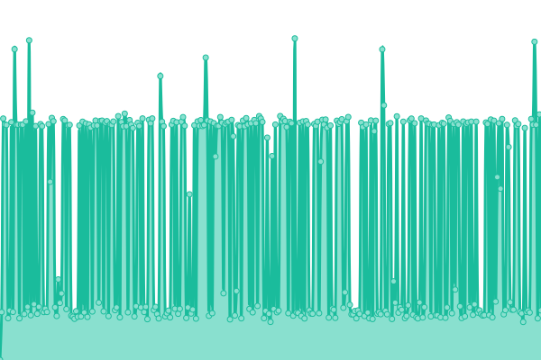
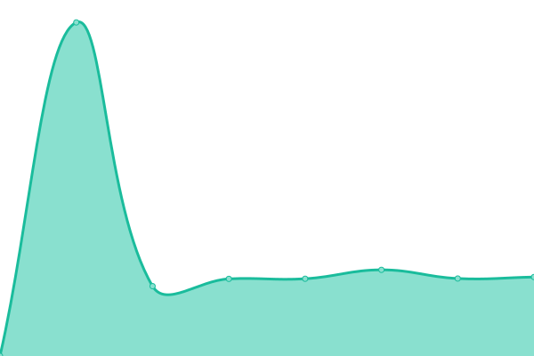
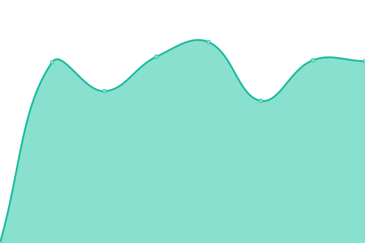

# [📈 Live Status](https://NehalDamania.github.io/becpl-uptime): <!--live status--> **🟧 Partial outage**

This repository contains the open-source uptime monitor and status page for [Nehal Damania](https://NehalDamania.github.io/becpl-uptime), powered by [Upptime](https://github.com/upptime/upptime).

With [Upptime](https://upptime.js.org), you can get your own unlimited and free uptime monitor and status page, powered entirely by a GitHub repository. We use [Issues](https://github.com/NehalDamania/becpl-uptime/issues) as incident reports, [Actions](https://github.com/NehalDamania/becpl-uptime/actions) as uptime monitors, and [Pages](https://NehalDamania.github.io/becpl-uptime) for the status page.

<!--start: status pages-->
<!-- This summary is generated by Upptime (https://github.com/upptime/upptime) -->
<!-- Do not edit this manually, your changes will be overwritten -->
<!-- prettier-ignore -->
| URL | Status | History | Response Time | Uptime |
| --- | ------ | ------- | ------------- | ------ |
|  Becpl Angular UI | 🟥 Down | [becpl-angular-ui.yml](https://github.com/NehalDamania/becpl-uptime/commits/HEAD/history/becpl-angular-ui.yml) | 

 3914ms
     
 | 

<a href="https://NehalDamania.github.io/becpl-uptime/history/becpl-angular-ui">56.58%</a>
    

|  Becpl Auth | 🟩 Up | [becpl-auth.yml](https://github.com/NehalDamania/becpl-uptime/commits/HEAD/history/becpl-auth.yml) | 

 1792ms
     
 | 

<a href="https://NehalDamania.github.io/becpl-uptime/history/becpl-auth">98.83%</a>
    

|  Becpl | 🟩 Up | [becpl.yml](https://github.com/NehalDamania/becpl-uptime/commits/HEAD/history/becpl.yml) | 

 2950ms
     
 | 

<a href="https://NehalDamania.github.io/becpl-uptime/history/becpl">97.54%</a>
    

<!--end: status pages-->

[**Visit our status website →**](https://NehalDamania.github.io/becpl-uptime)

## 📄 License

- Powered by: [Upptime](https://github.com/upptime/upptime)
- Code: [MIT](./LICENSE) © [Nehal Damania](https://NehalDamania.github.io/becpl-uptime)
- Data in the `./history` directory: [Open Database License](https://opendatacommons.org/licenses/odbl/1-0/)
